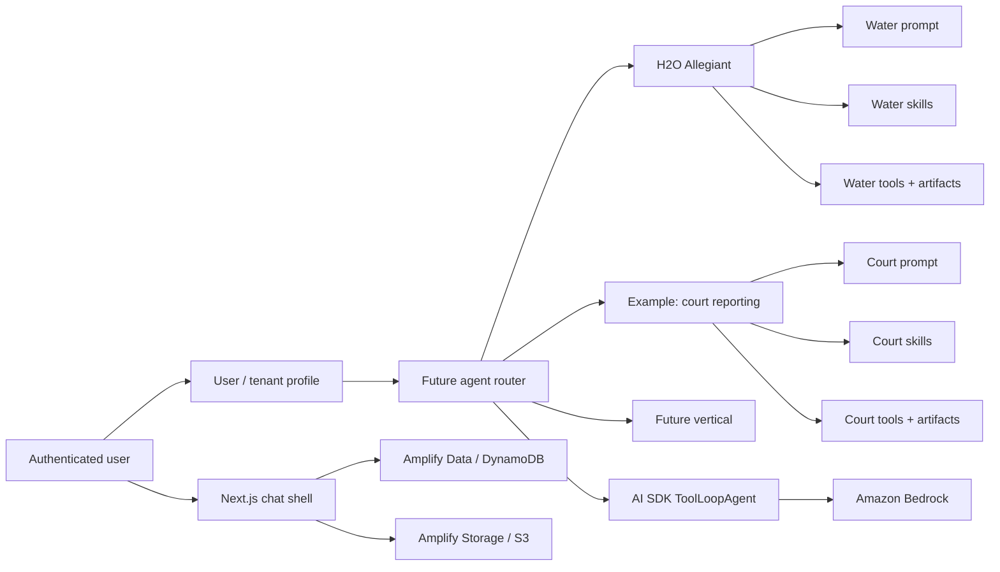

# Chamai

Chamai is a white-label AI agent workspace for vertical workflows. It provides the reusable product shell — authenticated chat, persistent threads, private attachments, streaming, artifact generation, and AWS-backed storage — while the long-term architecture lets each vertical own its prompt, skills, tools, artifacts, and brand.

The current implementation ships one vertical: **H2O Allegiant**, a wastewater business-development assistant that helps field teams turn messy opportunity evidence into draft field-support briefs grounded in the customer's economics.

## Product preview

<p align="center">
  
</p>

| Conversation workspace | Settings |
| --- | --- |
|  |  |

## Why this exists

Many vertical AI products need the same foundation: login, chat history, file handling, streaming responses, private storage, artifact generation, and deployment. Rebuilding that foundation for every niche wastes time.

Chamai separates the reusable platform from the domain-specific agent layer. The first vertical focuses on wastewater business development, where field teams often walk into customer conversations with fragmented inputs: permits, eDMR excerpts, call notes, case files, and spreadsheets. The product goal is to help turn that evidence into a clear internal position before the next customer conversation.

## Platform concept

| Layer | Responsibility |
| --- | --- |
| Product shell | Chat UI, thread management, attachments, generated artifact outputs, theme support |
| Identity & storage | Cognito auth, owner-scoped data, private files, artifact metadata and PDF outputs |
| Agent runtime | AI SDK `ToolLoopAgent`, Bedrock model provider, streaming, usage logging, tool repair |
| Vertical profile | Prompt, available skills, tools, artifact schemas, brand, workflow rules |

Today, the runtime is wired to the H2O Allegiant vertical. The data model already includes an `AgentConfig` foundation, and the intended direction is a per-user or per-tenant agent router that resolves the active prompt, skills, tools, model, artifact renderers, and brand at request time.



## Current vertical: H2O Allegiant

H2O Allegiant is a wastewater business-development workflow. It is not a generic document chatbot. Its job is to help a field team form a defensible internal position from customer evidence.

Typical inputs:

- NPDES permit excerpts and eDMR context
- customer call recaps
- case files, PDFs, images, or text notes
- opportunity-stage updates

Typical outputs:

- **Field Brief** — short internal handover focused on what this is, what to propose, what could kill the deal, and what to do next.
- **Conversation Playbook** — stage-aware questions for the next customer call.
- **Analytical Read** — evidence-tagged long-form read for manager review.
- **Proposal Shell** — draft scoping language that still requires human editing before customer use.

[Download the sample Prairie Field Brief](public/assets/prairie-field-brief.pdf)

## What it can do today

- Run an H2O Allegiant wastewater BD assistant with explicit human-review boundaries.
- Stream chat through an AWS Lambda Function URL instead of a production Next.js API route.
- Persist authenticated threads, messages, artifacts, and file metadata with Amplify Gen 2 Data by default.
- Store private attachments through Amplify Storage, with an explicit S3 rollback fallback.
- Validate attachments by count, size, MIME type, and model capability.
- Support thread create/list/delete plus conversation cloning and message-level branching.
- Generate H2O artifact PDFs through AI tool calls and persist their metadata.
- Keep owner-scoped working-memory settings for reuse across threads.
- Support dark and light themes.

## Technical highlights

- **Frontend**: Next.js App Router, React 19, TypeScript, Tailwind CSS v4, Shadcn UI.
- **Agent runtime**: AI SDK v6 `ToolLoopAgent` with Amazon Bedrock Claude Sonnet 4.6.
- **Prompt architecture**: static H2O prompt split from the auto-discovered skills block to preserve Bedrock prompt-cache stability.
- **Skills**: runtime `loadSkill` tool reads `src/ai/skills/<name>/SKILL.md`, strips frontmatter, validates names, and caches warm reads.
- **Tools**: H2O artifact generators for Field Brief, Playbook, Analytical Read, and Proposal Shell.
- **Persistence**: Amplify Data / DynamoDB for structured metadata; S3-backed storage for attachments and generated PDFs.
- **Transport**: browser chat requests post directly to the streaming Lambda Function URL from `amplify_outputs.json#custom.chatStreamingFunctionUrl`.
- **Runtime safety**: fail-fast Amplify output validation, attachment limits, owner-scoped access, tool-input repair, and usage logging.

## Architecture decisions worth noting

- The chat stream runs through a Lambda Function URL because long-running AI responses need backend access to Cognito verification, DynamoDB, S3, and Bedrock.
- The streaming Lambda writes Amplify-owned DynamoDB tables directly for lower-latency chat persistence while keeping Amplify Data as the product data model.
- Binary payloads stay out of chat rows: attachments and generated PDFs live in S3, while metadata lives in DynamoDB.
- Artifact PDFs are rendered eagerly inside tool execution. If rendering or schema validation fails, the model receives a tool error and can repair the call.
- CORS for the chat Function URL is intentionally allow-listed in `amplify/backend.ts`; adding a frontend domain requires backend redeploy.
- The current app runs one H2O agent. Multi-vertical routing is the product-platform direction, not something the README should pretend is already complete.

## Roadmap

- Profile-based agent routing from `AgentConfig`.
- Per-vertical prompt, skill, tool, and artifact registration.
- Tenant-specific branding and customer deployment profiles.
- Additional verticals, such as court reporting, with their own artifact suite.
- Stronger admin UX for configuring customer-specific agent behavior.
- Production observability around long-running agent and artifact generation.

## Getting Started

### Prerequisites

- [Bun](https://bun.sh)
- Node.js 22 LTS for Amplify CLI commands (`.nvmrc` pins this; run `nvm use` before sandbox/deploy commands)
- AWS credentials with access to Amazon Bedrock in `AWS_REGION`
- Amplify Gen 2 sandbox or deployment outputs for Auth, Data, and Storage

### Setup

```bash
bun install
cp .env.example .env
```

Start an Amplify sandbox or deploy the backend, then copy the generated outputs file into the project root:

```bash
nvm use
npx ampx sandbox
```

Use Bun for app scripts (`bun run dev`, `bun run test`, `bun run check`). Use Node 22 LTS for Amplify CLI commands; the official sandbox command is `npx ampx sandbox`, and non-LTS Node versions may fail before the sandbox starts.

The app intentionally keeps the checked-in `amplify_outputs.json` as a placeholder. Before release verification, replace it with the generated file and run:

```bash
bun run verify:amplify-config
```

Fill in the required AWS/Bedrock values in `.env`:

```dotenv
AWS_REGION=us-east-1
AWS_ACCESS_KEY_ID=your-aws-access-key
AWS_SECRET_ACCESS_KEY=your-aws-secret-key
# AWS_SESSION_TOKEN=your-aws-session-token
```

### Development

```bash
bun run dev
```

Opens the app at [http://localhost:3000](http://localhost:3000).

### Build

```bash
bun run build
```

### Test

```bash
bun run test
```

### Lint & Format

```bash
bun run lint
bun run format
bun run check
```

## Runtime Configuration

- Chat metadata store: Amplify Data.
- Attachment blob store: Amplify Storage with the Gen 2-valid `private/{entity_id}/*` access rule and nested per-session keys under `private/<identityId>/sessions/...`.
- Optional S3 rollback fallback: set `CHAT_BLOB_STORE_RUNTIME=s3` and provide `CHAT_ATTACHMENTS_S3_BUCKET` / `CHAT_ATTACHMENTS_S3_PREFIX`.
- Attachments are limited to 5 files per request, 4 MB per file, and 4 MB aggregate binary payload.
- Supported attachment types are plain text, markdown, CSV, HTML, PNG, JPEG, GIF, WebP, and PDF.
- PDF attachments require non-empty text in the same message.
- `amplify_outputs.json` must include `auth`, `data`, and `storage` sections before production smoke or release.

See `docs/amplify-sandbox-smoke.md` for the sandbox smoke checklist that cannot be proven from local mocks alone.

## Project status

This is an active product/portfolio codebase. The current implementation is the H2O Allegiant vertical on top of a reusable AI chat workspace. The next architectural step is turning the existing seams into a real white-label router that selects agent configuration by user, tenant, or vertical profile.
